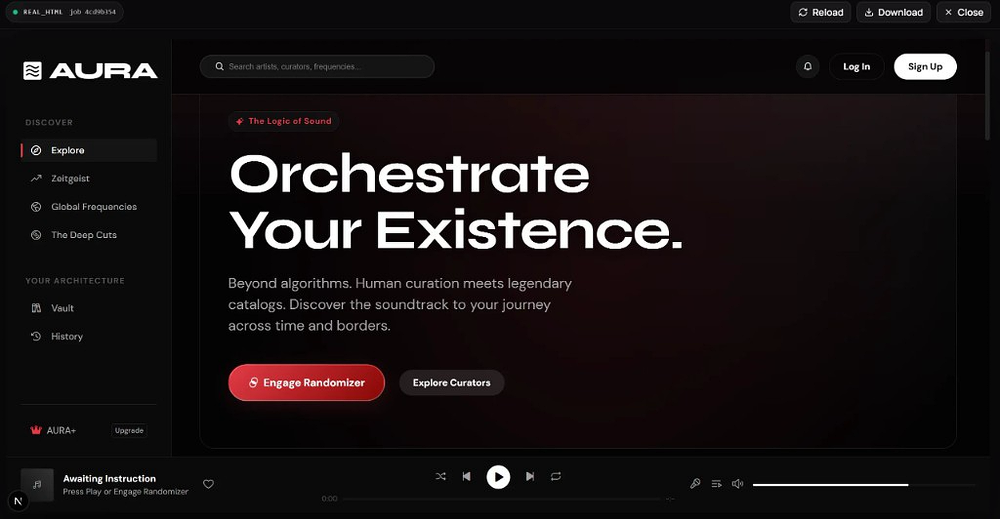
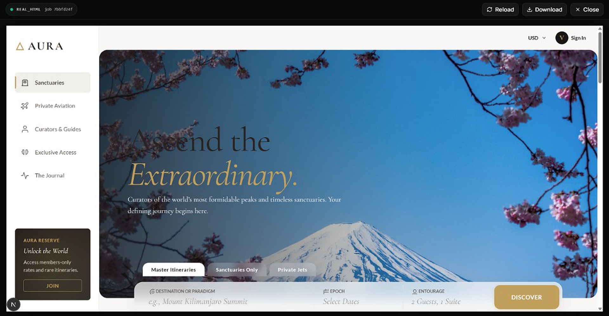

<a id="readme-top"></a>

<!-- Hero -->
<h1 align="center">🌐 Best Web Clone Skill</h1>

<h3 align="center">将任何网站克隆成一个独立的单文件 HTML 页面</h3>

<p align="center">
  <span style="color:#8b949e;font-size:14px;">Playwright 采集 · Gemini 生成 · Cursor Agent Skills</span>
</p>

<p align="center">
  
  
  
  
  
</p>

<p align="center">
  <a href="README.md"></a>
  <a href="README.zh-CN.md"></a>
</p>

<p align="center">
  <a href="https://github.com/legendyxu" title="legendyxu"></a>
  &nbsp;
  <a href="https://github.com/SteveRapeseed" title="SteveRapeseed"></a>
</p>

<p align="center">
  <sub>作者：<a href="https://github.com/legendyxu">legendyxu</a> & <a href="https://github.com/SteveRapeseed">SteveRapeseed</a></sub>
</p>

---

<a id="demo"></a>

## 📸 效果演示

**音乐平台克隆** — Prompt：`"做一个音乐网站"`

<p align="center">
  
</p>

**高端旅行平台克隆** — Prompt：`"做一个高端旅行网站"`

<p align="center">
  
</p>

<p align="right">(<a href="#readme-top">返回顶部</a>)</p>

---

## 📖 项目简介

**Best Web Clone Skill** 是一套面向 [Cursor](https://cursor.sh) 的可移植 Agent Skill 包，核心目标是把任意网站 URL 克隆为可在浏览器中直接打开的单文件 HTML 副本。

它**不是**传统爬虫或静态站点导出工具，而是一条三阶段自动化流水线：

1. **采集（Capture）** — Playwright 打开目标页面，执行全页滚动截图、提取 CSS，并可选录制滚动视频以触发 lazy load 内容。
2. **生成（Generate）** — 将截图与页面上下文发送给 Google Gemini，由模型根据视觉信息重建高保真 HTML 副本。
3. **同步（Sync）** — 将所有产物写入磁盘：`web_replica.html`、`source_snapshot.png`、`source_styles.css`、`run_manifest.txt`。

本技能包包含两个 skill。**大多数场景只需 `clone-skill`** — Prompt 扩展能力已经内置在克隆流水线中。

| 技能 | 是否必需 | 职责 |
|---|---|---|
| `clone-skill` | **必需** | 主克隆流水线 — 采集、生成、同步 |
| `expander-skill` | 可选 | 独立的 Cursor Agent 技能，用于**克隆前**单独扩展 Prompt |

### `clone-skill` 已内置 Expander

日常克隆**不需要**单独调用 `expander-skill`。

当你传入 `--instructions`（或在 Cursor 里附带简短创意描述）时，`clone_with_gemini.py` 会自动：

1. 推断网站类型（音乐、旅行、电商等）
2. 判断当前输入是否过短、需要扩展
3. 扩展为结构化设计 brief
4. 写入 `expanded_user_prompt.txt`
5. 连同页面截图一起发给 Gemini 生成 HTML

示例 — 以下命令已包含内置 Expander：

```bash
python3 cloneit-web-cloning/scripts/clone_with_gemini.py \
  "https://example.com" \
  --instructions "做一个音乐网站"
```

若想在生成前先审阅扩展后的 Prompt，可加 `--confirm-expanded-prompt`。

### 何时使用独立的 `expander-skill`

独立的 `expander-skill`（`EXPANDER_SKILL.md`）是**可选**的，适合在 Cursor 对话里、**不跑克隆命令**的情况下扩展 Prompt：

| 场景 | 用内置 Expander（`clone-skill`） | 用独立 `expander-skill` |
|---|---|---|
| 有 URL，并且有详细的 Prompt | ✅ 默认即可 | 不需要 |
| 已有 URL，想直接出 HTML | ✅ | 不需要 |
| **还没有 URL**，只有一个想法 | ❌ | ✅ 先扩展 Prompt |
| 想在对话里**多轮修改**设计 brief | ❌ | ✅ 适合来回打磨 |
| 想在克隆前审阅/编辑 Prompt | 可选（`--confirm-expanded-prompt`） | ✅ 更适合对话式修改 |
| 只要设计 brief，**暂时不要 HTML** | ❌ | ✅ |

独立 `expander-skill` 会引导 Cursor Agent 使用 `reference-library.md` 中的领域参考，并按「分类 → 拉取参考 → 提取约束 → 构建 Prompt → 与你确认」的流程工作。

**使用独立 Expander 的典型流程：**

```
扩展这条 Prompt："做一个深色音乐流媒体仪表盘"
→ 在对话里审阅、修改扩展后的 brief
→ 确认后再调用 clone-skill 生成 HTML
```

**不使用独立 Expander 的典型流程（最常见）：**

```
Clone https://example.com — 做一个音乐网站
→ clone-skill 自动扩展 Prompt 并生成 HTML
```

**适用场景：** 设计参考、页面存档、风格改造、快速原型生成。

<p align="right">(<a href="#readme-top">返回顶部</a>)</p>

---

## ✨ 功能特性

- **URL → 单文件 HTML** — 输入 URL，输出可离线打开的自包含 `.html`，无需服务器。
- **三阶段流水线** — `capture-matrix → replica-forge → artifact-sync`；各阶段独立，失败时易于定位。
- **深度浏览器采集** — 全页滚动截图、CSS 提取、可选滚动录屏，覆盖 lazy load 内容。
- **智能 Prompt 扩展** — 像 `"做成更深色"` 或 `"做一个音乐网站"` 这样的短指令，会在生成前自动扩展为完整设计 brief（已内置在 `clone-skill` 中）。
- **自动运行时引导** — 自动创建 `.runtime/venv`；若 venv 不可用则降级到 `.runtime/site-packages`，无需手动安装依赖。
- **双运行路径** — 支持宿主机 Python 或 Docker 容器，输出契约完全一致。
- **完整产物输出** — 生成 `web_replica.html`、`source_snapshot.png`、`source_styles.css`、`run_manifest.txt`，并保留兼容别名。

<p align="right">(<a href="#readme-top">返回顶部</a>)</p>

---

## 🛠 技术栈

| 类别 | 技术 |
|---|---|
| 语言与运行时 | Python 3.11+（Docker 镜像使用 3.12） |
| 核心依赖 | `google-genai`（Gemini SDK）、`playwright`（浏览器自动化） |
| AI 模型 | Google Gemini — 默认 `gemini-3.1-pro-preview`，回退 `gemini-3.0-pro-preview` |
| 浏览器引擎 | Playwright + Chromium；Docker 基础镜像 `mcr.microsoft.com/playwright/python:v1.58.0-noble` |
| 配置管理 | TOML（`cloneit.skill.toml`）、环境变量 / `.env`（`GOOGLE_GEMINI_API_KEY`） |
| 容器化 | Docker — 入口脚本 `clone_with_gemini.py` |
| Agent 集成 | Cursor Skill 体系（`CLONE_SKILL.md`、`EXPANDER_SKILL.md`） |
| CI | GitHub Actions（Python 3.12，运行时 bootstrap 验证） |
| 许可证 | Apache 2.0 |

<p align="right">(<a href="#readme-top">返回顶部</a>)</p>

---

## 🚀 快速开始

### 前置条件

- Python 3.11 或更高版本
- Google Gemini API Key（[在此获取](https://aistudio.google.com/app/apikey)）
- Cursor 编辑器（[下载](https://cursor.sh)）
- *（可选）* Docker，若希望使用容器化运行路径

### 安装步骤

1. **克隆仓库**

   ```bash
   git clone https://github.com/legendyxu/best-web-clone-skill.git
   cd best-web-clone-skill
   ```

2. **配置 Gemini API Key**

   在项目根目录创建 `.env` 文件：

   ```env
   GOOGLE_GEMINI_API_KEY=your_api_key_here
   ```

3. **安装依赖** *（技能会自动引导运行时，也可手动安装）*

   ```bash
   pip install google-genai playwright
   playwright install chromium
   ```

4. **将技能添加到 Cursor**

   - **必需：** [`cloneit-web-cloning/CLONE_SKILL.md`](cloneit-web-cloning/CLONE_SKILL.md) — 主技能，已内置 Prompt 扩展。
   - **可选：** [`.cursor/skills/prompt-expander/EXPANDER_SKILL.md`](.cursor/skills/prompt-expander/EXPANDER_SKILL.md) — 仅当你想在克隆**之前**于 Cursor 对话里单独扩展 Prompt 时才需要。

<p align="right">(<a href="#readme-top">返回顶部</a>)</p>

---

## 💡 使用方式

### 基础克隆

在 Cursor 对话中调用克隆技能并传入 URL：

```
Clone https://example.com
```

技能将运行完整流水线并输出：

```
outputs/
├── web_replica.html       ← 在浏览器中打开此文件
├── source_snapshot.png    ← 原始页面全页截图
├── source_styles.css      ← 提取的 CSS
└── run_manifest.txt       ← 流水线运行日志
```

### 带创意 Prompt 的克隆（内置 Expander）

```
Clone https://example.com — 做成深色模式，带霓虹强调色
```

或命令行：

```bash
python3 cloneit-web-cloning/scripts/clone_with_gemini.py \
  "https://example.com" \
  --instructions "做成深色模式，带霓虹强调色"
```

克隆流水线会自动扩展短指令，并在调用 Gemini 前写入 `expanded_user_prompt.txt`。**此场景不需要单独调用 `expander-skill`。**

### 独立 Expander（可选）

仅在需要**先打磨设计 brief、再克隆**时使用 — 例如还没有目标 URL，或希望在对话里多轮修改 Prompt：

```
扩展这条 Prompt："做一个暖色调、搜索优先的高端旅行落地页"
```

在对话里确认扩展后的 brief 后，再将其交给 `clone-skill` 生成 HTML。

<p align="right">(<a href="#readme-top">返回顶部</a>)</p>

---

## 🗺 路线图

### ✅ 已完成

- 核心克隆流水线（采集 → 生成 → 同步）
- 克隆流程内置 Prompt 扩展
- Docker 运行路径
- GitHub Actions CI

### 📋 计划中

- 多页面网站克隆
- 交互元素保留（表单、弹窗）
- 从克隆 HTML 导出 Figma
- 更多语言的 README 支持
- 进一步优化 `expander-skill`

完整功能列表与已知问题请查看 [open issues](https://github.com/legendyxu/best-web-clone-skill/issues)。

<p align="right">(<a href="#readme-top">返回顶部</a>)</p>

---

## 🤝 贡献

开源社区因学习、启发与创造而精彩。我们**非常感谢**你的每一份贡献。

**开始之前**，请先阅读 [贡献指南](CONTRIBUTING.md) 和 [行为准则](CODE_OF_CONDUCT.md)。

### 如何贡献

1. **Fork** 本仓库
2. **创建分支** 进行你的修改：
   ```bash
   git checkout -b feature/your-feature-name
   # 或修复 Bug：
   git checkout -b fix/your-bug-description
   ```
3. **修改代码** 并只暂存相关文件（避免使用 `git add .`）：
   ```bash
   git add <file1> <file2>
   git commit -m 'feat: add some amazing feature'
   ```
4. **推送** 到你的分支：
   ```bash
   git push origin feature/your-feature-name
   ```
5. **发起 Pull Request** — 说明改了什么、为什么改。

### 贡献方式

- 🐛 **报告 Bug** — 在 [Issue](https://github.com/legendyxu/best-web-clone-skill/issues) 中提供复现步骤
- 💡 **建议功能** — 在 [Issue](https://github.com/legendyxu/best-web-clone-skill/issues) 中打上 `enhancement` 标签
- 📖 **改进文档** — 修正错别字、澄清说明、补充示例
- 🧪 **编写测试** — 帮助提升克隆流水线的测试覆盖
- 🌐 **分享克隆案例** — 分享你克隆过的有趣网站

<p align="right">(<a href="#readme-top">返回顶部</a>)</p>

---

## 📄 许可证

基于 Apache 2.0 许可证分发。详见 `LICENSE`。

<p align="right">(<a href="#readme-top">返回顶部</a>)</p>

---

## 📬 联系方式

**legendyxu** — [legendyxuzhihao@outlook.com](mailto:legendyxuzhihao@outlook.com) — [GitHub](https://github.com/legendyxu)

**SteveRapeseed** — [steverapeseed@gmail.com](mailto:steverapeseed@gmail.com) — [GitHub](https://github.com/SteveRapeseed)

项目链接：[https://github.com/legendyxu/best-web-clone-skill](https://github.com/legendyxu/best-web-clone-skill)

<p align="right">(<a href="#readme-top">返回顶部</a>)</p>

---

## 🙏 致谢

- [Google Gemini](https://deepmind.google/technologies/gemini/) — 驱动 HTML 生成的多模态 AI
- [Playwright](https://playwright.dev/) — 浏览器自动化与截图采集
- [Shields.io](https://shields.io) — 徽章
- [Cursor](https://cursor.sh) — 本技能面向的 AI 编辑器

<p align="right">(<a href="#readme-top">返回顶部</a>)</p>

